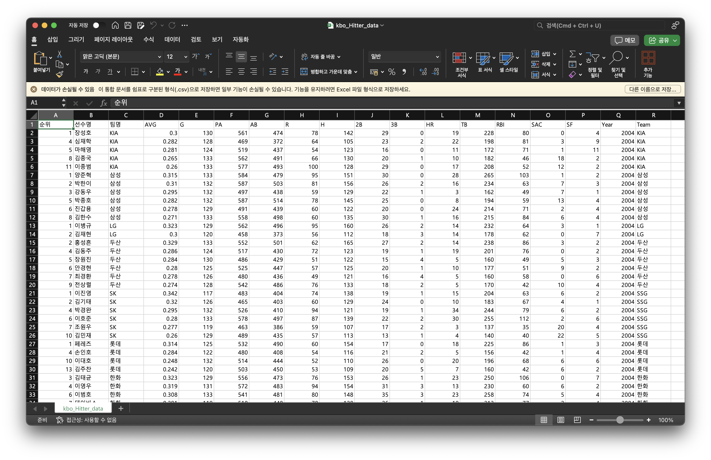
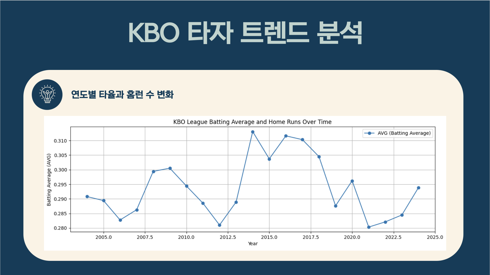
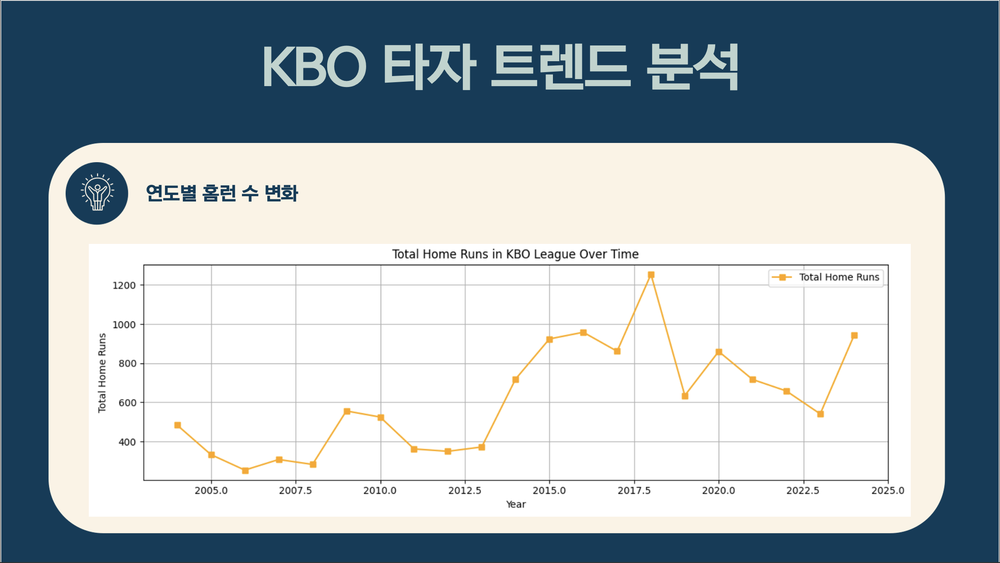
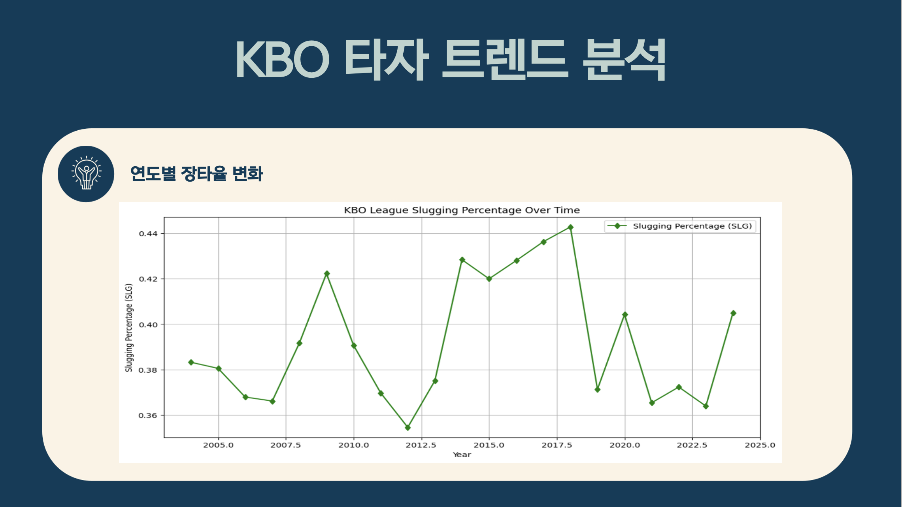
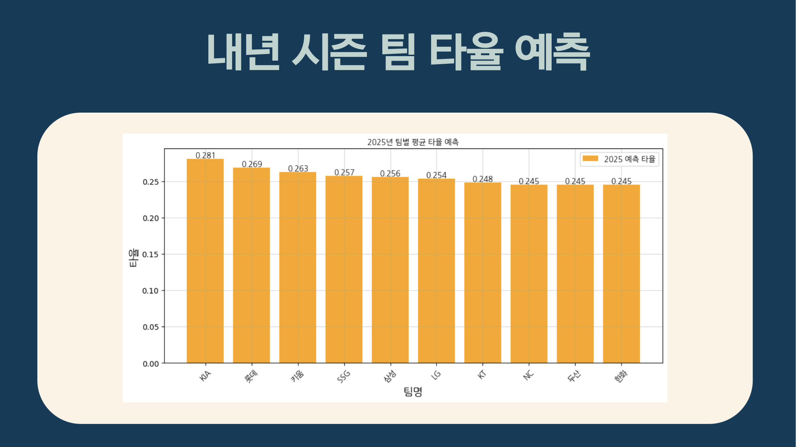

# KBO 타자 데이터 분석 프로젝트 🎯

> **20년간의 KBO 타자 데이터를 분석하여 미래를 예측하고, 리그 트렌드를 이해합니다.**  
> **예측된 2025 시즌 팀별 타율 및 타격 지표에 대한 통찰 제공**

## 📂 프로젝트 개요

KBO 리그의 방대한 데이터를 활용하여 과거의 리그 트렌드와 타격 지표를 분석하고, 머신러닝 모델을 통해 2025 시즌 팀별 타율 및 주요 타격 지표를 예측하는 프로젝트입니다.  

이 프로젝트는 데이터 크롤링, 전처리, 분석, 예측, 시각화의 모든 과정을 포함하여 리그의 역사를 되짚어보고, 향후 리그의 방향성을 제시합니다.

## 🏗 프로젝트 목표

1. **과거 트렌드 분석**:  
   - 2004년부터 2024년까지의 KBO 리그 타자 데이터를 기반으로 주요 타격 지표(타율, 홈런, 장타율 등)의 변화를 분석합니다.

   - 리그 내 주요 사건(공인구 변경, 외국인 타자 유입 등)이 타격 성적에 미친 영향을 파악합니다.

2. **미래 성적 예측**:  
   - 머신러닝 알고리즘을 활용하여 2025 시즌 팀별 주요 타격 지표(타율, 출루율 등)를 예측합니다.

   - 상위권 및 하위권 팀별 타율 편차를 분석하여 리그 경쟁 구도 예측.

3. **KBO 리그에 대한 통찰 제공**:  
   - 분석된 데이터를 바탕으로 리그 전체와 팀별 전략 개선 방안을 제안합니다.

   - 타격 환경 변화(공인구 조정, 투수 역량 강화 등)에 대한 통계적 인사이트를 제공합니다.

## 🚀 주요 기능

### 1️⃣ 데이터 수집
- **KBO 공식 웹사이트**를 기반으로 데이터를 크롤링하며, 수집 대상은 2004년부터 2024년까지의 타자 성적입니다.

- 크롤링한 데이터는 `data/` 디렉토리에 CSV 형식으로 저장됩니다.
- **크롤링 URL** :  
  [KBO Player Hitter Stats](https://www.koreabaseball.com/Record/Player/HitterBasic/Basic1.aspx?sort=HRA_RT)
- 데이터 수집 방법

- **데이터 수집(크롤링)코드 URL** :  
  [code](https://github.com/vinyl-nyl/KBO_Batter_Project/blob/main/Data_Collection_Refinement/KBO_Hitter_data_crawling.py)
- **데이터 수집 결과 URL** :  
  [csv file](https://github.com/vinyl-nyl/KBO_Batter_Project/blob/main/Data_Collection_Refinement/kbo_Hitter_data.csv)

### 2️⃣ 데이터 전처리
- 타석 446 이상 타자 데이터만 필터링하여 분석에 적합한 형태로 정제합니다.

- 팀명 통합 작업:
  - **SK → SSG**
  - **넥센/우리/히어로즈 → 키움**
- 결측값 처리 및 데이터 표준화를 통해 분석 신뢰도 확보

### 3️⃣ 데이터 분석
- 연도별 주요 타격 지표(타율, 홈런, 장타율 등)의 평균값과 변화 추이 시각화

- 팀별, 시즌별 성적을 비교 분석하여 리그 트렌드를 도출
- **데이터 분석 노트 URL** :  
  [code](https://github.com/vinyl-nyl/KBO_Batter_Project/blob/main/Data_Prediction_Analysis_Visualization/KBO_Hitter_Analysis_Trend.ipynb)

### 4️⃣ 데이터 예측
- 머신러닝 기법(랜덤 포레스트, XGBoost 등)을 사용하여 미래 타격 성적 예측:

  - **2025 시즌 타율 범위**: 0.245 ~ 0.281

  - 팀 간 성적 격차 분석

  - **데이터 예측 노트 URL** :  
  [code](https://github.com/vinyl-nyl/KBO_Batter_Project/blob/main/Data_Prediction_Analysis_Visualization/batting_average_prediction.ipynb)

### 5️⃣ 데이터 시각화
- 분석 결과를 시각적으로 표현하여 리그 트렌드와 예측 성적을 명확히 전달합니다:

  - 연도별 타율, 홈런, 장타율 변화 그래프
    - 연도별 타율/홈런 변화 그래프
    

    - 연도별 홈런 변화 그래프
    

    - 연도별 장타율 변화 그래프
    

  - 2025 시즌 예상 팀별 타율 막대그래프
  

## 📊 주요 분석 결론

### 1. 과거 타격 트렌드
- **타율**:  

  경향: 연도별 평균 타율은 일정한 수준을 유지하거나 약간의 변화만 보이는 경향이 있습니다.

  이는 KBO 리그에서 타격 환경(투수 수준, 공인구 변화 등)이 크게 변하지 않은 시점에서 평균 타율이 안정적으로 유지되었음을 나타냅니다.

  주요 요인: 평균 타율의 변화는 공인구 반발력 조정이나 리그 전체 경기 스타일(타격 중심 vs. 투수 중심)에 따라 영향을 받을 수 있습니다.
  

- **홈런**:  

  경향: 연도별 총 홈런 수는 특정 시점에서 증가하거나 감소하는 패턴이 나타납니다.

  예를 들어, 공인구 반발력 감소(2019년 등)로 홈런 수가 급감한 사례가 있을 수 있습니다.

  반대로 리그에 강타자(예: 외국인 타자)의 유입이 많았던 시점에서는 홈런 수가 증가한 경향이 보일 수 있습니다.

  의미: 리그 스타일이 타격 중심 또는 장타 중심으로 변화했는지 평가할 수 있습니다.

- **장타율**:  

  경향: 장타율은 홈런 수의 추이와 유사한 변화를 보이며, 리그의 전체적인 파워 히팅 트렌드를 반영합니다.

  홈런뿐 아니라 2루타, 3루타 등 다른 장타 요소들도 영향을 미쳤을 가능성이 있습다.

  주요 요인: 투수 수준의 변화, 공인구 반발력 조정, 경기장 크기 등의 요인이 장타율에 영향을 미쳤을 것입니다.

### 2. 2025 시즌 타율 예측
- **전반적인 리그 평균 타율**:  

  예측된 팀들의 타율 범위는 0.245 ~ 0.281로 나타나며, 리그 전반적으로 큰 격차는 보이지 않습니다.

  상위 팀과 하위 팀 간의 타율 차이는 0.036로 비교적 적은 편이어서 경쟁이 치열할 것으로 보입니다.

- **결론**:  

  KIA와 롯데는 타격에서 강점을 가진 팀으로 2025 시즌에서 상대적으로 높은 성적을 기대할 수 있습니다.

  하위권 팀들(KT, NC, 두산, 한화)은 타격력을 개선하기 위한 전략이 필요합니다.

  리그 전체적으로 타율 편차가 크지 않아, 투수진과 수비의 전략이 팀 성적에 중요한 영향을 미칠 가능성이 큽니다.